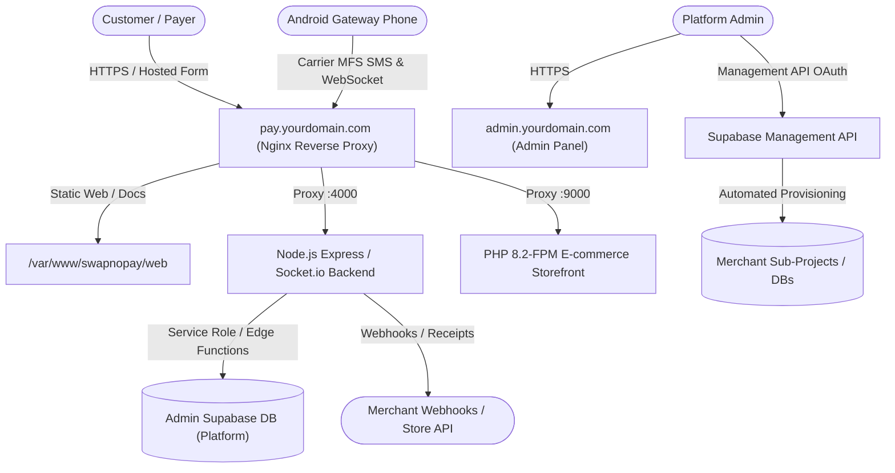

# Complete Production Deployment Guide: VPS, Domain, Supabase & Environment Setup

This document provides a comprehensive, production-grade manual to host and configure the complete **SwapnoPay** ecosystem on your Virtual Private Server (VPS), configure custom domains with SSL and WebSockets, set up both the **Admin Platform Database** and **Merchant Databases** in Supabase, configure the **Supabase Management API**, and prepare all required `.env` parameters.

---

## 1. Architecture Topology & Domain Planning

The system comprises three core layers:



### Recommended DNS Configuration:
Point your domain's DNS records (e.g., in Cloudflare, Namecheap, or Route53) to your VPS Public IPv4 Address:

| Type | Name | Target / Value | Proxy Status | Purpose |
|---|---|---|---|---|
| **A** | `pay` | `YOUR_VPS_IP` | Proxied (Cloudflare) / DNS Only | Backend API, Hosted Checkout & Docs |
| **A** | `admin` | `YOUR_VPS_IP` | Proxied (Cloudflare) / DNS Only | Admin CMS Control Panel |
| **A** | `shop` | `YOUR_VPS_IP` | Proxied (Cloudflare) / DNS Only | Merchant E-Commerce Web Storefront |
| **A** | `api` | `YOUR_VPS_IP` | Proxied (Cloudflare) / DNS Only | Direct API Alias (optional) |

> [!IMPORTANT]
> If using **Cloudflare**:
> 1. Set SSL/TLS Encryption Mode to **Full** or **Full (Strict)**.
> 2. In Cloudflare **Network** settings, ensure **WebSockets** is toggled **ON**.

---

## 2. VPS Server Provisioning & Hardening (Ubuntu 22.04 / 24.04 LTS)

### Step 2.1: Update System & Install Core Packages
Connect to your VPS via SSH as `root` (or sudo user):
```bash
ssh root@YOUR_VPS_IP

# Update apt repositories and upgrade packages
apt update && apt upgrade -y

# Install essential build tools, networking tools, and Git
apt install -y curl wget git unzip ufw software-properties-common build-essential nginx certbot python3-certbot-nginx
```

### Step 2.2: Setup Firewall (`ufw`)
```bash
ufw default deny incoming
ufw default allow outgoing
ufw allow 22/tcp       # SSH
ufw allow 80/tcp       # HTTP
ufw allow 443/tcp      # HTTPS
ufw enable
```

### Step 2.3: Install Node.js v20 (LTS) & PM2
```bash
curl -fsSL https://deb.nodesource.com/setup_20.x | bash -
apt install -y nodejs

# Verify versions
node -v   # Should be v20.x.x
npm -v    # Should be 10.x.x

# Install PM2 globally to manage Node.js processes
npm install -g pm2
pm2 startup
```

### Step 2.4: Install Docker & Docker Compose (Optional for Containerized Deployments)
```bash
curl -fsSL https://get.docker.com | sh
usermod -aG docker $USER
apt install -y docker-compose-plugin
```

---

## 3. Clone Repository & Directory Structure on VPS

```bash
mkdir -p /var/www/swapnopay
cd /var/www/swapnopay

# Clone your project repository (or upload using SCP/rsync)
git clone https://github.com/joy24-student/swapnopayweb.git .
```

Ensure the following directory structure exists:
```
/var/www/swapnopay/
├── admin/                  # Vite + React Admin Panel
├── swapnopay-backend/      # Express API & Socket.io Backend
├── web/                    # Checkout widget, hosted forms, docs
├── shop/                   # PHP e-commerce storefront
├── supabase/               # SQL schemas & Edge Functions
└── nginx.conf              # Nginx template
```

---

## 4. Setting Up Supabase: Admin Database & Management API

You need two Supabase contexts:
1. **Admin Supabase Project (Platform Owner)**: Houses gateway configuration, platform admins, system settings, showcase/video configs, MFS regexes, and device tokens.
2. **Supabase Management API**: Allows your platform to automatically create, manage, and provision database projects for onboarded merchants.

---

### Step 4.1: Create Admin Supabase Project
1. Log in to [Supabase Dashboard](https://supabase.com/dashboard).
2. Click **New Project** and configure:
   - **Name**: `SwapnoPay Admin Platform`
   - **Database Password**: Generate a secure 24+ character password and record it.
   - **Region**: Choose closest to your merchants (e.g., `Singapore (ap-southeast-1)` or `Central India`).
3. Once created, navigate to **Project Settings → API** and copy:
   - **Project URL**: `https://<admin-ref>.supabase.co`
   - **anon / public key**: `eyJhbGciOi...`
   - **service_role key**: `eyJhbGciOi...` (Keep secret!)

---

### Step 4.2: Execute Admin Database Schemas
In your Admin Supabase Project, go to the **SQL Editor** (left menu) and run the scripts in this exact sequence:

1. **Run `supabase/ADMIN_DATABASE_SCHEMA.sql`**:
   - Creates `platform_admins`, `merchants`, `gateways`, `system_config`, `showcase_config`, `system_health`, `payment_links`, `support_tickets`, and `mfs_regexes`.
   - Sets up automatic RLS policies and table structures.

2. **Run `supabase/ADMIN_MIGRATION_001_firebase_removal.sql`**:
   - Ensures all legacy Firebase triggers are replaced with pure Supabase PostgreSQL triggers.

3. **Seed Super Admin Account**:
   Run the following query in the SQL Editor to grant admin access to your email:
   ```sql
   INSERT INTO platform_admins (email, role, is_active)
   VALUES ('your-email@yourdomain.com', 'SUPER_ADMIN', true)
   ON CONFLICT (email) DO UPDATE SET role = 'SUPER_ADMIN', is_active = true;
   ```

4. **Seed System Remote Config (for mobile app & docs sync)**:
   ```sql
   INSERT INTO showcase_config (key, value)
   VALUES ('system_config', '{
     "developer_portal_url": "https://pay.yourdomain.com/docs",
     "developer_docs_url": "https://pay.yourdomain.com/docs",
     "api_portal_url": "https://admin.yourdomain.com/keys",
     "webhook_docs_url": "https://pay.yourdomain.com/docs#webhooks",
     "support_hotline": "+8801700000000",
     "support_email": "support@yourdomain.com",
     "support_whatsapp": "+8801700000000",
     "video_tutorials": []
   }')
   ON CONFLICT (key) DO UPDATE SET value = EXCLUDED.value;
   ```

---

### Step 4.3: Configure Supabase Management API

The Management API allows SwapnoPay to programmatically interact with Supabase (list projects, run migrations, and fetch API credentials).

#### Method A: Personal Access Token (Fastest & Simplest)
1. Go to [Supabase Account Tokens](https://supabase.com/dashboard/account/tokens).
2. Click **Generate New Token**.
3. Name it `SwapnoPay VPS Backend Engine`.
4. Copy the generated token (`sbp_...`).
5. Save this token as `SUPABASE_MANAGEMENT_API_KEY` in your environment.

#### Method B: OAuth 2.0 PKCE Application (Multi-Merchant Self-Connect)
If you want individual merchants to click **"Connect Supabase"** from their admin dashboard:
1. Go to [Supabase Account OAuth Apps](https://supabase.com/dashboard/account/apps).
2. Click **Add App**:
   - **App Name**: `SwapnoPay Integration Hub`
   - **Redirect URI**: `https://admin.yourdomain.com/connect-supabase`
   - **Website URL**: `https://yourdomain.com`
3. Copy the **Client ID** and **Client Secret**.

---

### Step 4.4: Deploy Edge Functions
From your local development machine or VPS with Supabase CLI installed:
```bash
# Login to Supabase CLI
npx supabase login

# Link to your admin project
npx supabase link --project-ref <YOUR_ADMIN_PROJECT_REF>

# Deploy all edge functions
npx supabase functions deploy create-order --no-verify-jwt
npx supabase functions deploy process-sms --no-verify-jwt
npx supabase functions deploy provision --no-verify-jwt
npx supabase functions deploy hosted-form --no-verify-jwt

# Set Edge Function Secrets
npx supabase secrets set ADMIN_SECRET="your-32-character-admin-secret"
npx supabase secrets set PAYMENT_WEBHOOK_SECRET="your-32-character-webhook-secret"
npx supabase secrets set SUPABASE_MANAGEMENT_API_KEY="sbp_your_management_token"
```

---

## 5. Complete Environment Variables (`.env`) Reference

### 5.1: Backend Environment: `/var/www/swapnopay/swapnopay-backend/.env`
Create `/var/www/swapnopay/swapnopay-backend/.env`:
```ini
PORT=4000
NODE_ENV=production
TRUST_PROXY_HOPS=1

# ──────────────────────────────────────────────────────────────────────────────
# Admin Supabase Credentials (Platform Database)
# ──────────────────────────────────────────────────────────────────────────────
ADMIN_SUPABASE_URL=https://<your-admin-project-ref>.supabase.co
ADMIN_SUPABASE_ANON_KEY=eyJhbGciOiJIUzI1NiIsInR5cCI6IkpXVCJ9...
ADMIN_SUPABASE_SERVICE_ROLE_KEY=eyJhbGciOiJIUzI1NiIsInR5cCI6IkpXVCJ9...

# ──────────────────────────────────────────────────────────────────────────────
# Security Keys (Generate using: openssl rand -hex 32)
# ──────────────────────────────────────────────────────────────────────────────
# Used by Admin Panel to authenticate against /v1/admin/*
ADMIN_SECRET=8e9b3f07a23c4d5e6f7a8b9c0d1e2f3a4b5c6d7e8f9a0b1c2d3e4f5a6b7c8d9e

# Pepper for hashing merchant API secret keys
API_KEY_PEPPER=1a2b3c4d5e6f7a8b9c0d1e2f3a4b5c6d7e8f9a0b1c2d3e4f5a6b7c8d9e0f1a2b

# Secret verified on incoming carrier SMS webhooks
PAYMENT_WEBHOOK_SECRET=4f5a6b7c8d9e0f1a2b3c4d5e6f7a8b9c0d1e2f3a4b5c6d7e8f9a0b1c2d3e4f5a

# ──────────────────────────────────────────────────────────────────────────────
# CORS Configuration (Comma-separated allowed origins)
# ──────────────────────────────────────────────────────────────────────────────
ALLOWED_ORIGINS=https://pay.yourdomain.com,https://admin.yourdomain.com,https://shop.yourdomain.com

# ──────────────────────────────────────────────────────────────────────────────
# Optional: Gmail OAuth2 Receipts (Nodemailer)
# ──────────────────────────────────────────────────────────────────────────────
GMAIL_CLIENT_ID=
GMAIL_CLIENT_SECRET=
GMAIL_REFRESH_TOKEN=
GMAIL_FROM_EMAIL=receipts@yourdomain.com
GMAIL_FROM_NAME=SwapnoPay Automated Billing
```

---

### 5.2: Admin Panel Environment: `/var/www/swapnopay/admin/.env`
Create `/var/www/swapnopay/admin/.env`:
```ini
# Platform Owner's Supabase (Admin database)
VITE_ADMIN_SUPABASE_URL=https://<your-admin-project-ref>.supabase.co
VITE_ADMIN_SUPABASE_ANON_KEY=eyJhbGciOiJIUzI1NiIsInR5cCI6IkpXVCJ9...

# Merchant Supabase (Default or connected merchant DB)
VITE_SUPABASE_URL=https://<your-admin-project-ref>.supabase.co
VITE_SUPABASE_ANON_KEY=eyJhbGciOiJIUzI1NiIsInR5cCI6IkpXVCJ9...

# Backend API URL
VITE_BACKEND_URL=https://pay.yourdomain.com
```

---

### 5.3: Web Portal Configuration: `/var/www/swapnopay/web/`
In `/var/www/swapnopay/web/docs.html`, `/var/www/swapnopay/web/portal.js`, and `/var/www/swapnopay/web/widget.js`, verify the Supabase constants:
```javascript
const SUPABASE_URL = "https://<your-admin-project-ref>.supabase.co";
const SUPABASE_ANON_KEY = "eyJhbGciOiJIUzI1NiIsInR5cCI6IkpXVCJ9...";
```

---

## 6. Configuring Nginx & SSL Certificates on VPS

### Step 6.1: Configure `/etc/nginx/sites-available/swapnopay`
Create the Nginx virtual host configuration:
```bash
sudo nano /etc/nginx/sites-available/swapnopay
```

Paste the following production configuration (replace `yourdomain.com` with your actual domain):

```nginx
# 1. Gateway, API, Hosted Checkout & Docs (pay.yourdomain.com)
server {
    listen 80;
    server_name pay.yourdomain.com;

    root /var/www/swapnopay/web;
    index index.html widget.html docs.html;

    # Gzip Compression
    gzip on;
    gzip_types text/plain text/css application/json application/javascript text/xml application/xml application/xml+rss text/javascript;

    # Static Web Assets / Hosted Forms
    location ~* ^/(f|forms|form)/ {
        add_header Access-Control-Allow-Origin "*" always;
        add_header Access-Control-Allow-Methods "GET, POST, OPTIONS" always;
        try_files $uri /form.html?$args;
    }

    location / {
        add_header Access-Control-Allow-Origin "*" always;
        add_header Access-Control-Allow-Methods "GET, POST, OPTIONS" always;
        add_header Access-Control-Allow-Headers "Content-Type, Authorization, X-Webhook-Secret" always;
        try_files $uri $uri/ /index.html;
    }

    # API Proxy to Node.js Backend
    location /v1/ {
        proxy_pass http://127.0.0.1:4000/v1/;
        proxy_http_version 1.1;
        proxy_set_header Host $host;
        proxy_set_header X-Real-IP $remote_addr;
        proxy_set_header X-Forwarded-For $proxy_add_x_forwarded_for;
        proxy_set_header X-Forwarded-Proto $scheme;
    }

    # Uploads Proxy
    location /uploads/ {
        proxy_pass http://127.0.0.1:4000/uploads/;
        proxy_http_version 1.1;
        proxy_set_header Host $host;
        proxy_set_header X-Real-IP $remote_addr;
        proxy_set_header X-Forwarded-For $proxy_add_x_forwarded_for;
        proxy_set_header X-Forwarded-Proto $scheme;
    }

    # Socket.io WebSocket Support
    location /socket.io/ {
        proxy_pass http://127.0.0.1:4000/socket.io/;
        proxy_http_version 1.1;
        proxy_set_header Upgrade $http_upgrade;
        proxy_set_header Connection "Upgrade";
        proxy_set_header Host $host;
        proxy_set_header X-Real-IP $remote_addr;
        proxy_set_header X-Forwarded-For $proxy_add_x_forwarded_for;
        proxy_read_timeout 86400s;
        proxy_send_timeout 86400s;
    }

    location /healthz {
        proxy_pass http://127.0.0.1:4000/healthz;
    }
}

# 2. Admin Panel CMS (admin.yourdomain.com)
server {
    listen 80;
    server_name admin.yourdomain.com;

    root /var/www/swapnopay/admin/dist;
    index index.html;

    location / {
        try_files $uri $uri/ /index.html;
    }
}
```

### Step 6.2: Enable Site and Obtain Let's Encrypt SSL
```bash
# Link configuration and test syntax
sudo ln -sf /etc/nginx/sites-available/swapnopay /etc/nginx/sites-enabled/
sudo rm -f /etc/nginx/sites-enabled/default
sudo nginx -t

# Reload Nginx
sudo systemctl reload nginx

# Issue Free SSL Certificates via Certbot
sudo certbot --nginx -d pay.yourdomain.com -d admin.yourdomain.com --non-interactive --agree-tos -m admin@yourdomain.com
```

---

## 7. Build & Start Services with PM2

### Step 7.1: Build Admin Panel
```bash
cd /var/www/swapnopay/admin
npm install
npm run build
# Creates /var/www/swapnopay/admin/dist
```

### Step 7.2: Install & Start Backend Engine
```bash
cd /var/www/swapnopay/swapnopay-backend
npm install --production

# Start with PM2
pm2 start src/index.js --name "swapnopay-backend"
pm2 save
```

---

## 8. Final Live Verification Checklist

Run these quick checks from your terminal or browser:

1. **Backend Healthcheck**:
   ```bash
   curl -I https://pay.yourdomain.com/healthz
   # Expected: HTTP/2 200 OK
   ```
2. **API Endpoint Test**:
   ```bash
   curl https://pay.yourdomain.com/v1/health
   # Expected: {"status":"healthy","timestamp":...}
   ```
3. **Admin Panel Access**:
   - Open `https://admin.yourdomain.com` in your browser.
   - Log in with your configured admin email.
   - Go to **System Settings → Video Tutorials & API Docs CMS** to verify real-time Supabase synchronization.
4. **Developer Portal Screen**:
   - Open `https://pay.yourdomain.com/docs` to test the Web Developer Portal.
   - In the Android app, navigate to **More → Developer Portal** to verify in-app credentials and 1-click markdown copy.
